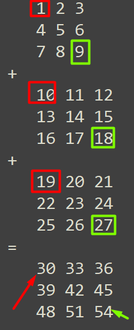

# Ejercicio 19 - Arrays
## Descripción del ejercicio
Se crearán arrays unidimiensionales y multidimensionales y se poblarán de elementos.
A continuación se convertirán los arrays de tipo entero en arrays de cadena, para luego recorrer cada uno de ellos y se mostrar sus 
elementos por pantalla. En el caso del array tridimensional se le aplicará un flatting.

### Objetivos
* Crear un *Array* unidimensional de tipo entero e inicializarlo en el método ``createAndPopulateUnidimensionalArray()``. 
  Hacer lo mismo para un array bidimensional y el tridimensional, también de tipo entero, en los métodos ``createAndPopulateBidimensionalArray()`` y 
  ``createAndPopulateTridimensionalArray ()``, respectivamente.
* Cada método de creación de arrays ya está siendo invocado desde el ``main()`` recibiendo como parámetros en cada caso números enteros que 
  indican la cantidad de elementos de cada dimensión. Con esos valores, construir los arrays correspondientes (habrá que usar for).


* Completar y usar el método ``getUnidimensionalString()`` para recorrer el array unidimensional de tipo entero y devolver un *String* 
  único compuesto por los elementos del array de tipo *int* (usar la clase ``StringBuilder``). Así: 
  * Array de tipo *int* original: ``[1, 2, 3, 4, 5]`` → *String* generado: `"1 2 3 4 5"` 


* Completar y usar el método ``getBidimensionalString()`` para invocar desde él al método ``stringFlatMatrixRow()`` ya proporcionado en el 
  ejercicio. El método ``getBidimensionalString()`` recibe un array bidimensional e invoca a ``stringFlatMatrixRow()``, pasándole dicho 
  array bidimensional y un entero correspondiente a cada uno de los elementos de su primera dimensión. ``stringFlatMatrixRow()`` a su 
  vez invocará al método ``getUnidimensionalString()`` que se completó previamente. Así que es importante completar bien previamente el 
  método ``getUnidimensionalString()``, porque será utilizado por otros métodos para convertir a *String* cada dimensión. El método 
  ``getBidimensionalString()`` finalmente devolverá un *String* compuesto línea a línea por cada secuencia de elementos. Por ejemplo: 
  * Array de ejemplo de tipo *int* original: `[ [1, 2, 3] , [4, 5, 6], [7, 8, 9] ]` → *String* generado: `"1 2 3\n4 5 6\n7 8 9"`
  

* Completar y usar el método ``flatTridimensionalArray``. Este método recibe un array tridimensional de tipo *int* y devolverá un 
  array bidimensional de tipo *int*. El array bidimensional que debe devolver es el resultado del "flatting" (aplanamiento) del array 
  tridimiensinal. Aplanar un array tridimensional consiste en sumar uno a uno los elementos que tienen la misma posición en cada matriz 
  de nueve elementos. De esta forma, partiendo de un array de [3][3][3] se obtiene un array de [3][3]. Por ejemplo:



### Elementos de la colección
Los tres arrays serán de tipo *int*.
* Primer array → 5 elementos: [5]
* Segundo array → 3 elementos en la primera dimensión y otros 3 en la segunda: [3][3]
* Tercer array → 2 elementos en cada dimensión: [2][2][2]

### Requisitos
* No se pueden modificar en absoluto las clases de test.

### Test

```
mvn test
```